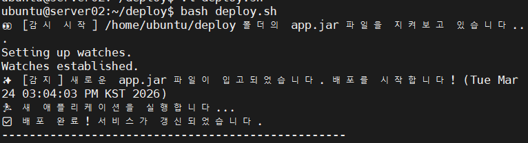
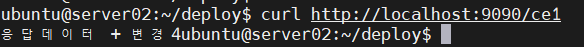

# 🚀 springboot-jar-deploy

> **SCP 전송 한 번으로 완성되는 무중단 자동 재배포 파이프라인**  
> **빌드와 배포 사이의 공백을 자동화로 채우다**

로컬 Windows 환경에서 빌드한 JAR 파일을 SCP로 전송하면, Ubuntu 서버가 이를 자동으로 감지하여 기존 프로세스를 정리하고 새로운 서비스를 실행하는 자동 배포 실습 프로젝트입니다.

---
## 🙋‍♀️ 팀원 소개

<table>
  <tr>
    <td align="center">
      <br />
      <a href="https://github.com/Yewon0106">유예원</a>
    </td>
    <td align="center">
      <br />
      <a href="https://github.com/minykang">강민영</a>
    </td>
  </tr>
</table>

---
## 📌 프로젝트 개요

springboot-jar-deploy는  
Windows에서 빌드한 Spring Boot JAR 파일을 Ubuntu 서버에 전송하면,  
서버가 이를 자동 감지해 기존 프로세스를 종료하고 새 버전을 실행하는 배포 자동화 프로젝트입니다.

기존에는 JAR 전송 후 서버에 직접 접속해  
프로세스 종료와 재실행을 수동으로 처리해야 했습니다.

이 프로젝트에서는 inotify-tools와 Bash 스크립트를 활용해  
**감지 → 종료 → 실행** 흐름을 자동화했습니다.

---

## 🔄 Deployment Comparison

| 분류 | ❌ 기존 수동 배포 | ✅ 자동화 배포 |
|---|---|---|
| 과정 | SCP 전송 → 서버 접속 → PID 검색 → 프로세스 종료 → JAR 실행 | SCP 전송 → 자동 감지 → 자동 종료 → 자동 실행 |
| 소요 시간 | 약 2~3분 | 감지 후 5~10초 내 |
| 실수 가능성 | 포트 종료 누락, 경로 오타 등 휴먼 에러 발생 가능 | 스크립트 기반으로 일관된 배포 가능 |

---

## 🎖️ 주요 기능

### 1. 실시간 파일 시스템 감시
inotifywait를 활용하여 /home/ubuntu/deploy 폴더에서 **app.jar** 파일의 close_write 이벤트를 감지합니다.  
파일 전송이 완전히 끝난 시점을 기준으로 배포 스크립트를 실행해 불완전한 파일 상태에서 배포되지 않도록 구성했습니다.

### 2. 포트 충돌 자동 방지
배포 전에 lsof 명령어로 9090 포트를 사용 중인 기존 Java 프로세스를 탐지하고, kill -15로 안전하게 종료합니다.  
이를 통해 포트 충돌로 인해 새 애플리케이션이 실행되지 않는 상황을 줄였습니다.

### 3. 중복 실행 방지
파일 전송 과정에서 발생할 수 있는 중복 이벤트를 처리하기 위해 **COOLDOWN** 로직을 적용했습니다.  
짧은 시간 안에 같은 파일 이벤트가 여러 번 발생해도 한 번만 배포가 수행되도록 구성해 불필요한 재실행을 방지했습니다.

---

## 🧰 기술 스택

| 분류 | 기술 |
|---|---|
| OS | Ubuntu 24.04 LTS, Windows 11 |
| Framework | Spring Boot 3.x, Java 17 |
| Monitoring | inotify-tools |
| Scripting | Bash Shell Script |
| Connectivity | Git Bash, SCP |

---

## ⚙️ 시스템 아키텍처

- **Windows**
  - ./gradlew build로 JAR 파일 생성
  - scp로 Ubuntu 서버의 배포 폴더에 전송

- **Ubuntu**
  - inotifywait가 app.jar 파일 변경 감지
  - deploy.sh 실행

- **배포 흐름**
  - 기존 9090 포트 점유 프로세스 종료
  - 잠시 대기
  - 새 버전 JAR 실행
  - 로그 파일 기록

---

## 🚀 Workflow Steps

### 1. Build & Push
로컬에서 애플리케이션을 빌드하고 서버로 JAR 파일을 전송합니다.

```bash
./gradlew clean build
scp ./build/libs/*.jar ubuntu@server:/home/ubuntu/deploy/app.jar
```
### 2. Event Capture

서버는 inotifywait를 사용해 /home/ubuntu/deploy 폴더에서 app.jar 파일의 close_writ` 이벤트를 감지합니다.  
파일 전송이 완료되면 통합 배포 스크립트가 이어서 실행됩니다.

```bash
inotifywait -m -e close_write /home/ubuntu/deploy
```
### 3. Port Cleaning

새로운 JAR 파일이 감지되면, 기존 9090 포트를 사용 중인 프로세스를 찾아 종료합니다.
이를 통해 포트 충돌 없이 새 버전을 실행할 수 있도록 했습니다.

```bash
TARGET_PID=$(lsof -ti:9090)
kill -15 $TARGET_PID
```
### 4. Application Restart

기존 프로세스 종료 후 새 app.jar를 다시 실행해 갱신된 버전이 반영되도록 구성했습니다.

```bash
nohup java -jar /home/ubuntu/deploy/app.jar > /home/ubuntu/deploy/app.log 2>&1 &
```

---

## 📦 Spring Boot Build & JAR 기반 배포

### 1. Spring Boot Build 과정

이 프로젝트는 **Gradle 기반 Spring Boot 애플리케이션**입니다.

Windows 로컬 환경에서 코드를 수정한 뒤, 아래 명령어로 실행 가능한 JAR 파일을 생성합니다.

```
./gradlew clean build
```

위 명령어는 다음 작업을 수행합니다.

- 기존 build 결과 삭제
- 소스 코드 컴파일
- 테스트 수행
- 실행 가능한 JAR 생성

<br/>

### 2. JAR 파일 생성 위치

빌드가 완료되면 JAR 파일은 다음 경로에 생성됩니다.

```
build/libs/
```

예시:

```
step06_buildGradleTest-0.0.1-SNAPSHOT.jar
step06_buildGradleTest-0.0.1-SNAPSHOT-plain.jar
```

<br/>

### 3. 실행용 JAR vs Plain JAR

Spring Boot 프로젝트는 빌드 시 두 종류의 JAR가 생성될 수 있습니다.

| 파일명 | 설명 | 사용 여부 |
| --- | --- | --- |
| `step06_buildGradleTest-0.0.1-SNAPSHOT.jar` | 실행 가능한 Spring Boot JAR (내장 Tomcat 포함) | ✅ 사용 |
| `step06_buildGradleTest-0.0.1-SNAPSHOT-plain.jar` | 일반 Java 라이브러리 JAR | ❌ 사용 안 함 |

배포 시에는 반드시 **plain이 붙지 않은 실행용 JAR**를 사용해야 합니다.


<br/>


### 4. JAR 기반 배포 전략

이 프로젝트는 **서버에서 소스코드를 빌드하지 않고**,

**Windows에서 빌드한 JAR 파일을 그대로 Ubuntu 서버에 전달하는 방식**으로 동작합니다.

전체 흐름은 다음과 같습니다.

1. Windows에서 코드 수정
2. `./gradlew clean build`로 새로운 JAR 생성
3. `scp`로 Ubuntu 서버에 `app.jar` 업로드
4. Ubuntu에서 파일 변경 감지
5. 기존 프로세스 종료
6. 새 JAR 실행
7. 변경된 서비스 즉시 반영

<br/>

### 5. Spring Boot 실행 설정

실행 포트는 `application.properties`에서 설정했습니다.

```
spring.application.name=step06_buildGradleTest
server.port=9090
```

실습 환경에서는 8080 포트 대신 9090 포트를 사용해 정상 실행되도록 구성했습니다.

<br/>

## 📁 프로젝트 구조 예시
```bash
/home/ubuntu/deploy
├── app.jar
├── app.log
└── deploy.sh
```
## 🖥️ 배포 스크립트

본 프로젝트에서는 파일 감시와 재배포 로직을 하나의 Bash 스크립트로 통합했습니다.
app.jar 변경 감지 후 기존 프로세스를 종료하고 새 애플리케이션을 실행하는 흐름을 자동화했습니다.
```md
### `deploy.sh`

```bash
#!/bin/bash

WATCH_DIR="/home/ubuntu/deploy"
JAR_FILE="app.jar"
COOLDOWN=15
LAST_RUN=0

echo "👀 [감시 시작] $WATCH_DIR 폴더의 $JAR_FILE 파일을 지켜보고 있습니다..."

inotifywait -m -e close_write "$WATCH_DIR" |
while read -r directory events filename; do
    if [ "$filename" = "$JAR_FILE" ]; then
        CURRENT_TIME=$(date +%s)

        if (( CURRENT_TIME - LAST_RUN > COOLDOWN )); then
            echo "✨ [감지] 새로운 $filename 파일이 입고되었습니다. 배포를 시작합니다! ($(date))"
            LAST_RUN=$CURRENT_TIME

            TARGET_PID=$(lsof -ti:9090)
            if [ -n "$TARGET_PID" ]; then
                echo "🛑 기존 프로세스($TARGET_PID)를 종료합니다."
                kill -15 $TARGET_PID
                sleep 5
            fi

            echo "🏃 새 애플리케이션을 실행합니다..."
            nohup java -jar "$WATCH_DIR/$JAR_FILE" > "$WATCH_DIR/app.log" 2>&1 &

            echo "✅ 배포 완료! 서비스가 갱신되었습니다."
            echo "--------------------------------------------------"
        else
            echo "⏳ [대기] 쿨다운 기간 중입니다. 잠시 후 다시 시도해주세요."
        fi
    fi
done
```

## 📈 실행 결과

app.jar 파일 전송 후 서버가 이를 자동으로 감지했고, 기존 프로세스를 종료한 뒤 새 애플리케이션을 9090 포트에서 정상적으로 재실행했습니다.  
이후 로그와 엔드포인트 응답을 통해 배포가 정상 완료되었음을 확인했습니다.

### 1. 자동 재배포 실행 로그


### 2. 엔드포인트 응답 확인


## 🚨 트러블슈팅
**1. Unexpected operator 오류**
- 문제점: sh로 실행할 때 비교 구문에서 오류가 발생했습니다.
- 원인: Ubuntu 기본 sh 환경과 Bash 문법 차이 때문이었습니다.
- 해결: bash deploy.sh로 실행하도록 변경해 해결했습니다.
  
**2. 80 포트 실행 실패**
- 문제점: Ubuntu 서버에서 `server.port=80`으로 실행 시 애플리케이션이 기동되지 않았습니다.
- 원인: 일반 사용자 계정으로는 1024 이하의 포트 바인딩에 권한 문제가 발생할 수 있었습니다.
- 해결: `application.properties`에서 실행 포트를 `9090`으로 변경하여 정상 실행되도록 수정했습니다.

**3. plain.jar 파일 사용 혼동**
- 문제점: 빌드 후 생성된 `-plain.jar`와 실행용 JAR 중 어떤 파일을 배포해야 하는지 혼동이 있었습니다.
- 원인: Spring Boot Gradle 빌드 시 실행 가능한 JAR와 일반 JAR가 함께 생성되기 때문이었습니다.
- 해결: 배포 시에는 **plain이 붙지 않은 실행용 JAR만 사용**하도록 정리했습니다.

**4. 애플리케이션 실행 실패로 보였던 문제**
- 문제점: watch 스크립트에서 배포 직후 실패 메시지가 출력되었습니다.
- 원인: Spring Boot 애플리케이션이 완전히 기동되기 전에 포트 체크를 수행해, 실제로는 실행 중인데 실패로 오판정한 경우가 있었습니다.
- 해결: 실행 후 일정 시간 대기하거나 반복 확인 로직을 추가해 정상 기동 여부를 더 안정적으로 판별하도록 개선했습니다.

## ✅ 실행 방법
```bash
sudo apt update
sudo apt install -y inotify-tools lsof
chmod +x deploy.sh
bash deploy.sh
scp ./build/libs/*.jar ubuntu@server:/home/ubuntu/deploy/app.jar
```

## 🚀 향후 개선 방향

| 기능 | 설명 | 기대 효과 |
|---|---|---|
| Health Check | 배포 후 정상 응답 확인 로직 추가 | 배포 성공 여부 자동 검증 |
| Rollback | 실행 실패 시 이전 버전 복구 | 배포 안정성 향상 |
| Slack/Discord 알림 | 배포 결과를 메시지로 전송 | 서버 접속 없이 상태 확인 |
